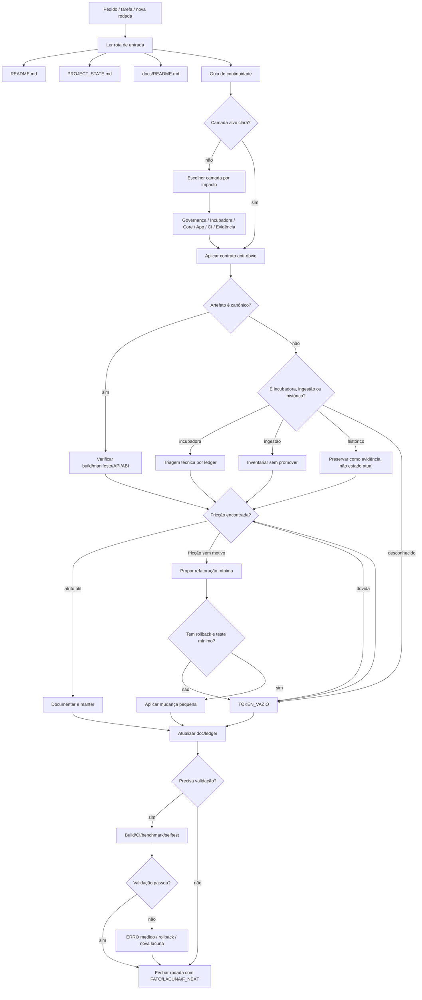

# VECTRA_GLOBAL_HOLISTIC_FLOWMAP

## Estado

`FATO_DOCUMENTADO`: mapa holístico global da Vectra para orientar humanos e IA na escolha do melhor caminho de execução, documentação, triagem, refatoração e validação.

Este documento existe para abrir espaço de visão antes de agir. Ele não substitui os ledgers de camada; ele mostra o campo inteiro e a ordem saudável de travessia.

---

## Frase canônica

```text
Ver o todo antes de mexer na parte: a Vectra precisa de fluxo, camada, evidência e retorno, não de impulso local.
```

---

## Visão global

A Vectra deve ser lida como um sistema de sete campos:

| Campo | Função |
|---|---|
| Entrada institucional | README, PROJECT_STATE, DOC_INDEX, hub técnico |
| Governança de leitura | anti-óbvio, TOKEN_VAZIO, doc atrasada, fricção determinística |
| Incubadora técnica | `Rafaelia/`, `_incoming/`, `tools/baremetal/rafcode_phi/` |
| Core canônico | `engine/rmr/include`, `engine/rmr/src`, manifestos |
| Runtime/app | `app/`, Java/Kotlin, JNI, VM, QEMU, VNC, X11, Termux |
| Validação | CI, build, tests, benchmarks, release, assinatura |
| Memória/evidência | `reports/`, `archive/`, `Incluir/`, `addthis/`, docs ativos |

---

## Fluxograma holístico



---

## Caminho de melhor decisão

A ordem preferida é:

```text
1. continuidade de leitura;
2. camada alvo;
3. classificação;
4. evidência;
5. fricção;
6. decisão mínima;
7. documentação;
8. validação;
9. F_NEXT.
```

---

## Heurística de escolha da próxima camada

| Pergunta | Caminho |
|---|---|
| Há falha simples que bloqueia leitura/build? | corrigir com shim/compat mínimo, se permitido |
| Há incubadora com alto valor e risco de perda? | ledger progressivo antes de promoção |
| Há documentação atrasada confundindo IA/humano? | doc ativa antes de código |
| Há core canônico dependendo de manifesto? | verificar manifesto antes de mover |
| Há claim de build/performance? | CI/benchmark antes de concluir |
| Há arquivo pesado/zip/doc/imagem? | inventário e proveniência antes de uso |

---

## Melhor caminho atual observado

A partir das rodadas recentes, o caminho mais saudável é:

```text
P0 — preservar visão global e continuidade;
P1 — fechar triagem RAFAELIA B1–B4;
P2 — entender script de build ARM32;
P3 — resolver shim baremetal.h quando a escrita permitir;
P4 — comparar RAFAELIA incubadora com engine/rmr;
P5 — só então propor promoção ou refatoração;
P6 — validar por build/CI/benchmark quando possível.
```

---

## Onde não avançar ainda

```text
não promover B1/B2/B3 como core;
não reescrever ASM por estética;
não apagar _incoming;
não normalizar histórico;
não declarar performance;
não tratar B3 como erro antes de medir runtime;
não trocar include legado se o shim preserva melhor a intenção;
```

---

## Relação entre campos

```text
Rafaelia/              → incubadora técnica
_incoming/             → ingestão e sementes pendentes
engine/rmr/            → core canônico
app/                   → runtime operacional Android/VM/JNI
reports/               → evidência e inventário
docs/active/           → contratos vivos
PROJECT_STATE.md       → limite de afirmação atual
```

---

## Padrão de fechamento por rodada

Toda rodada deve fechar com:

```text
camada_alvo:
arquivos_lidos:
o_que_foi_criado:
o_que_foi_alterado:
o_que_nao_foi_mexido:
fato_confirmado:
lacuna_protegida:
token_vazio:
falha/bloqueio:
proximo_f_next:
```

---

## Frase final

```text
A visão holística não atrasa o trabalho; ela impede que o trabalho certo seja feito no lugar errado.
```
